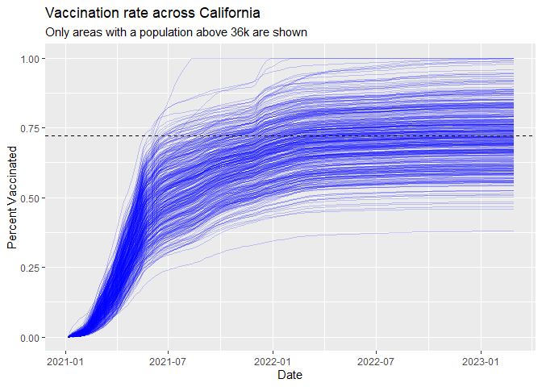

Class17: Mini Project
================
Colin Mach (A16673100)

``` r
vax <- read.csv("covid19vaccinesbyzipcode_test.csv")
head(vax)
```

      as_of_date zip_code_tabulation_area local_health_jurisdiction    county
    1 2021-01-05                    95446                    Sonoma    Sonoma
    2 2021-01-05                    96014                  Siskiyou  Siskiyou
    3 2021-01-05                    96087                    Shasta    Shasta
    4 2021-01-05                    96008                    Shasta    Shasta
    5 2021-01-05                    95410                 Mendocino Mendocino
    6 2021-01-05                    95527                   Trinity   Trinity
      vaccine_equity_metric_quartile                 vem_source
    1                              2 Healthy Places Index Score
    2                              2    CDPH-Derived ZCTA Score
    3                              2    CDPH-Derived ZCTA Score
    4                             NA            No VEM Assigned
    5                              3    CDPH-Derived ZCTA Score
    6                              2    CDPH-Derived ZCTA Score
      age12_plus_population age5_plus_population tot_population
    1                4840.7                 5057           5168
    2                 135.0                  135            135
    3                 513.9                  544            544
    4                1125.3                 1164             NA
    5                 926.3                  988            997
    6                 476.6                  485            499
      persons_fully_vaccinated persons_partially_vaccinated
    1                       NA                           NA
    2                       NA                           NA
    3                       NA                           NA
    4                       NA                           NA
    5                       NA                           NA
    6                       NA                           NA
      percent_of_population_fully_vaccinated
    1                                     NA
    2                                     NA
    3                                     NA
    4                                     NA
    5                                     NA
    6                                     NA
      percent_of_population_partially_vaccinated
    1                                         NA
    2                                         NA
    3                                         NA
    4                                         NA
    5                                         NA
    6                                         NA
      percent_of_population_with_1_plus_dose booster_recip_count
    1                                     NA                  NA
    2                                     NA                  NA
    3                                     NA                  NA
    4                                     NA                  NA
    5                                     NA                  NA
    6                                     NA                  NA
      bivalent_dose_recip_count eligible_recipient_count
    1                        NA                        0
    2                        NA                        0
    3                        NA                        2
    4                        NA                        2
    5                        NA                        0
    6                        NA                        0
                                                                   redacted
    1 Information redacted in accordance with CA state privacy requirements
    2 Information redacted in accordance with CA state privacy requirements
    3 Information redacted in accordance with CA state privacy requirements
    4 Information redacted in accordance with CA state privacy requirements
    5 Information redacted in accordance with CA state privacy requirements
    6 Information redacted in accordance with CA state privacy requirements

# Q1

percent_of_population_fully vaccinated details the total number of
people fully vaccinated

# Q2

zip_code_tabulation_area details the Zip code tabulation area

# Q3

The earliest date is 1/5/2021

# Q4

The latest date is 2/28/2023

Using the skim() function for a quick overview of a new data set

``` r
skimr::skim(vax)
```

|                                                  |        |
|:-------------------------------------------------|:-------|
| Name                                             | vax    |
| Number of rows                                   | 199332 |
| Number of columns                                | 18     |
| \_\_\_\_\_\_\_\_\_\_\_\_\_\_\_\_\_\_\_\_\_\_\_   |        |
| Column type frequency:                           |        |
| character                                        | 5      |
| numeric                                          | 13     |
| \_\_\_\_\_\_\_\_\_\_\_\_\_\_\_\_\_\_\_\_\_\_\_\_ |        |
| Group variables                                  | None   |

Data summary

**Variable type: character**

| skim_variable             | n_missing | complete_rate | min | max | empty | n_unique | whitespace |
|:--------------------------|----------:|--------------:|----:|----:|------:|---------:|-----------:|
| as_of_date                |         0 |             1 |  10 |  10 |     0 |      113 |          0 |
| local_health_jurisdiction |         0 |             1 |   0 |  15 |   565 |       62 |          0 |
| county                    |         0 |             1 |   0 |  15 |   565 |       59 |          0 |
| vem_source                |         0 |             1 |  15 |  26 |     0 |        3 |          0 |
| redacted                  |         0 |             1 |   2 |  69 |     0 |        2 |          0 |

**Variable type: numeric**

| skim_variable                              | n_missing | complete_rate |     mean |       sd |    p0 |      p25 |      p50 |      p75 |     p100 | hist  |
|:-------------------------------------------|----------:|--------------:|---------:|---------:|------:|---------:|---------:|---------:|---------:|:------|
| zip_code_tabulation_area                   |         0 |          1.00 | 93665.11 |  1817.38 | 90001 | 92257.75 | 93658.50 | 95380.50 |  97635.0 | ▃▅▅▇▁ |
| vaccine_equity_metric_quartile             |      9831 |          0.95 |     2.44 |     1.11 |     1 |     1.00 |     2.00 |     3.00 |      4.0 | ▇▇▁▇▇ |
| age12_plus_population                      |         0 |          1.00 | 18895.04 | 18993.87 |     0 |  1346.95 | 13685.10 | 31756.12 |  88556.7 | ▇▃▂▁▁ |
| age5_plus_population                       |         0 |          1.00 | 20875.24 | 21105.97 |     0 |  1460.50 | 15364.00 | 34877.00 | 101902.0 | ▇▃▂▁▁ |
| tot_population                             |      9718 |          0.95 | 23372.77 | 22628.51 |    12 |  2126.00 | 18714.00 | 38168.00 | 111165.0 | ▇▅▂▁▁ |
| persons_fully_vaccinated                   |     16525 |          0.92 | 13962.33 | 15054.09 |    11 |   930.00 |  8566.00 | 23302.00 |  87566.0 | ▇▃▁▁▁ |
| persons_partially_vaccinated               |     16525 |          0.92 |  1701.64 |  2030.18 |    11 |   165.00 |  1196.00 |  2535.00 |  39913.0 | ▇▁▁▁▁ |
| percent_of_population_fully_vaccinated     |     20825 |          0.90 |     0.57 |     0.25 |     0 |     0.42 |     0.60 |     0.74 |      1.0 | ▂▃▆▇▃ |
| percent_of_population_partially_vaccinated |     20825 |          0.90 |     0.08 |     0.09 |     0 |     0.05 |     0.06 |     0.08 |      1.0 | ▇▁▁▁▁ |
| percent_of_population_with_1\_plus_dose    |     21859 |          0.89 |     0.63 |     0.24 |     0 |     0.49 |     0.67 |     0.81 |      1.0 | ▂▂▅▇▆ |
| booster_recip_count                        |     72872 |          0.63 |  5837.31 |  7165.81 |    11 |   297.00 |  2748.00 |  9438.25 |  59553.0 | ▇▂▁▁▁ |
| bivalent_dose_recip_count                  |    158664 |          0.20 |  2924.93 |  3583.45 |    11 |   190.00 |  1418.00 |  4626.25 |  27458.0 | ▇▂▁▁▁ |
| eligible_recipient_count                   |         0 |          1.00 | 12801.84 | 14908.33 |     0 |   504.00 |  6338.00 | 21973.00 |  87234.0 | ▇▃▁▁▁ |

# Q5

There are 13 numeric columns in this dataset.

# Q6

``` r
sum(is.na(vax$persons_fully_vaccinated))
```

    [1] 16525

There are 16525 NA values in the fully vaccinated column

# Q7

``` r
round(sum(is.na(vax$persons_fully_vaccinated))/nrow(vax), digits = 3)*100
```

    [1] 8.3

8.3% of the column for fully vaccinated data is missing

# Q8

The data is missing probably because it wasn’t reported in these
specific zip codes for these dates or was redacted due to privacy laws
due to being federal land or not state territory

``` r
library(lubridate)
```


    Attaching package: 'lubridate'

    The following objects are masked from 'package:base':

        date, intersect, setdiff, union

``` r
today()
```

    [1] "2023-03-16"

``` r
vax$as_of_date <- ymd(vax$as_of_date)
today() - vax$as_of_date[1]
```

    Time difference of 800 days

# Q9

7 days have passed since the last update of the dataset

``` r
today() - vax$as_of_date[nrow(vax)]
```

    Time difference of 16 days

# Q10

``` r
length(unique(vax$as_of_date))
```

    [1] 113

There are 113 unique dates

``` r
library(zipcodeR)
geocode_zip('92037')
```

    # A tibble: 1 × 3
      zipcode   lat   lng
      <chr>   <dbl> <dbl>
    1 92037    32.8 -117.

``` r
zip_distance('92037','91108')
```

      zipcode_a zipcode_b distance
    1     92037     91108   105.36

``` r
reverse_zipcode(c('92037', "92019"))
```

    # A tibble: 2 × 24
      zipcode zipcode_…¹ major…² post_…³ common_c…⁴ county state   lat   lng timez…⁵
      <chr>   <chr>      <chr>   <chr>       <blob> <chr>  <chr> <dbl> <dbl> <chr>  
    1 92019   Standard   El Caj… El Caj… <raw 20 B> San D… CA     32.8 -117. Pacific
    2 92037   Standard   La Jol… La Jol… <raw 20 B> San D… CA     32.8 -117. Pacific
    # … with 14 more variables: radius_in_miles <dbl>, area_code_list <blob>,
    #   population <int>, population_density <dbl>, land_area_in_sqmi <dbl>,
    #   water_area_in_sqmi <dbl>, housing_units <int>,
    #   occupied_housing_units <int>, median_home_value <int>,
    #   median_household_income <int>, bounds_west <dbl>, bounds_east <dbl>,
    #   bounds_north <dbl>, bounds_south <dbl>, and abbreviated variable names
    #   ¹​zipcode_type, ²​major_city, ³​post_office_city, ⁴​common_city_list, …

``` r
sd <- vax[vax$county =="San Diego",]
```

``` r
library(dplyr)
```


    Attaching package: 'dplyr'

    The following objects are masked from 'package:stats':

        filter, lag

    The following objects are masked from 'package:base':

        intersect, setdiff, setequal, union

``` r
sd <- filter(vax, county == "San Diego")
nrow(sd)
```

    [1] 12091

``` r
sd.10 <- filter(vax, county =="San Diego" & age5_plus_population > 10000)
```

# Q11

``` r
length(unique(sd))
```

    [1] 18

There are 18 unique zip codes for San Diego

# Q12

``` r
sd$zip_code_tabulation_area[which.max(sd$age12_plus_population)]
```

    [1] 92154

# Q13

``` r
recentsd <- filter(vax, as_of_date == "2023-02-28")
mean(recentsd$percent_of_population_fully_vaccinated, na.rm = TRUE)*100
```

    [1] 69.15199

69% is the overall average of the percent of population fully vaccinated
based on data we currently have in SD county as of 2023-02-28

# Q14

``` r
library(ggplot2)
ggplot(recentsd, aes(x=percent_of_population_fully_vaccinated)) + geom_histogram() + labs (title = "Vaccination Rate Across San Diego as of Last Week", x = "Percent of Population Fully Vaxed", y = "Count (ZIP code area)")
```

    `stat_bin()` using `bins = 30`. Pick better value with `binwidth`.

    Warning: Removed 148 rows containing non-finite values (`stat_bin()`).


# Focus on UCSD/La Jolla

``` r
ucsd <- filter(sd, zip_code_tabulation_area=="92037")
ucsd[1,]$age5_plus_population
```

    [1] 36144

# Q15

``` r
ucsdgraph <- ggplot(ucsd) + aes(x = as_of_date, y = percent_of_population_fully_vaccinated) + geom_point() + geom_line(group = 1) + ylim(c(0,1)) + labs(x="Date", y = "Percent Vaccinated")
```

# Q16

``` r
vax.36 <- filter(vax, age5_plus_population > 36144 & as_of_date == "2023-02-28")
meanline <- mean(vax.36$percent_of_population_fully_vaccinated)
ucsdgraph + geom_hline(aes(yintercept=meanline))
```


# Q17

``` r
summary(vax.36$percent_of_population_fully_vaccinated)
```

       Min. 1st Qu.  Median    Mean 3rd Qu.    Max. 
     0.3804  0.6457  0.7181  0.7213  0.7907  1.0000 

# Q18

``` r
ggplot(vax.36,aes(percent_of_population_fully_vaccinated)) + geom_histogram() + xlim(0,1)
```

    `stat_bin()` using `bins = 30`. Pick better value with `binwidth`.

    Warning: Removed 2 rows containing missing values (`geom_bar()`).


# Q19

``` r
vax %>% filter(as_of_date == "2023-02-28") %>% filter(zip_code_tabulation_area=="92109") %>% select(percent_of_population_fully_vaccinated)
```

      percent_of_population_fully_vaccinated
    1                               0.694572

``` r
vax %>% filter(as_of_date == "2023-02-28") %>% filter(zip_code_tabulation_area=="92040") %>% select(percent_of_population_fully_vaccinated)
```

      percent_of_population_fully_vaccinated
    1                               0.550296

Both 92109 and 92040 ZIP code areas are below the average value I
calculated for La Jolla vaccination rate.

# Q20

``` r
vax.36.all <- filter(vax, age5_plus_population > 36144)


ggplot(vax.36.all) +
  aes(x = as_of_date, y = percent_of_population_fully_vaccinated,
      percent_of_population_fully_vaccinated, 
      group=zip_code_tabulation_area) +
  geom_line(alpha=0.2, color="blue") +
  ylim(0,1) +
  labs(x="Date", y="Percent Vaccinated",
       title="Vaccination rate across California",
       subtitle="Only areas with a population above 36k are shown") +
  geom_hline(yintercept = meanline, linetype=2)
```

    Warning: Removed 183 rows containing missing values (`geom_line()`).


